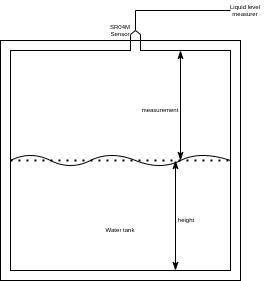
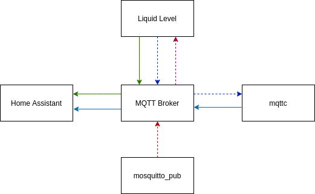

# Liquid Level

(Last update: 2021/06/29)

The reason why I started this project is because I wanted to know how much water was in my rain tank and how much was in my gasoline tank for heating. Those measurements need to end up in `Home Assistant`

In the drawing below we are interested in the height.

## Hardware

I use

* a SRO4M as a sonar measuring system (TODO add link)
* a NodeMcu, that I had lying around from a previous project.

### NodeMCU

As explained in the section above, I had one laying around. Any other ESP8266 based device could be used as well. The requirements are

* we need a 3V3 and GND pin to connect to power the sensor
* we need two free digital GPIO pins to communicate with the sensor

There is an abundance of devices on the market that fit this description.

### SR04M

#### How it works

The device is very simple to use:
* you trigger the sonar to make a trigger high.
* this causes the sensor to send out an ultra sound wave.
* When the sensor picks up the echo of that wave, it signals its master
* You can easily retrieve the number of microseconds between the two events.

This time is the can then be turned in cm. If you assume that the speed of sound is 340m/s and take into account that the sound has to travel twice the distant of the measure. The conversions is

$$
\tag {i} m = 0,017d
$$

Where 
* $m$ is the measurement
* $d$ is the duration in microseconds between the trigger and the echo measured in the NodeMCU.

There are several things wrong with (i), e.g. the speed of sound depends on the temperature amongst other things. For our purposes, the formula is good enough as the conditions in the water tank are relatively stable.

#### Calibration

We did different tests between 30cm and 200cm. This is the range in which the measurements were taken. We measured the microseconds as described above.
The results we got were

| Distance (cm) | Delay (µs) |
| ----: | ----: |
| 30 | 1649
| 40 | 2239
| 50 | 2818
| 60 | 3399
| 70 | 3983
| 80 | 4558
| 90 | 5142
| 100 | 5715
| 110 | 6295
| 120 | 6871
| 130 | 7453
| 140 | 8034
| 150 | 8623
| 160 | 9212
| 170 | 9792
| 180 | 10388
| 190 | 10966
| 200 | 11549

We want a formula that turns the µs into cm. Using linear regression on the data above we find that the formula is

$$
\tag {ii} m = 0.01719 * d + 1.6566
$$

Note that this is a little more than 0.017 we put forward in (1). It is consistent with the speed of sound in a room of +- 21°C.

Note that the constant does hot interest us at this time. We need the water level. This is calculated as

$$
\tag {iii} h = t - m
$$

where
* $t$ is the total height of the tank.

When installing the device we will measure $h$ and $m$. By calculating $t = h + m$ we will automatically include the constant term in $t$. 

#### Errors

While collecting the data above we noticed the following:

1. the first readout was always 0
2. every now and then we received a measure that was way off from the expected readout.
3. otherwise, for a given distance the measurements were stable in the first three digits.

An example of these erroneous measure is the following series of 10 delays we measured.

6295 6294 6294 6295 6295 6294 7504 6294 6294 6275

The 7th measurement is totally different from the others. It is 10 cm different from the rest. Liquid levels are not stable. When water is added to the tank e.g. waves will be seen. But none of that would be 10 cm high.

We will detect this using something called _relative standard deviation_ (RSD). The RSD tells you whether the “regular” standard deviation is a small or large quantity when compared to the mean for the data set. It is expressed in percentages.

$$
\tag {iv} RSD = \frac {s * 100} {\vert \bar{x} \vert}
$$

Where 
* $s$ is the standard deviation
* $\bar{x}$ is the sample mean over the 10 measurements that we take.

$`s`$ is here the sample standard deviation. In essence an estimate for the standard deviation. The formula is

$$
\tag {v} s = \frac 1 {n - 1}\sqrt{ \sum (x_i - \vert \bar{x} \vert} )²
$$

Where 
* $`n`$ is the sample size (in our case 10)
* $`x_i`$ is the i-th sample

## MQTT

We designed the communication over MQTT because it is designed for IoT.

MQTT works with a central broker. We are using [mosquitto](https://mosquitto.org/). It comes with a broker and with two clients `mosquitto_pub` to publish information and `mosquitto_sub` to get information.

Information is managed through topics. MQTT is going for simplicity on the client side. Topics pop into existence whenever needed. A client can publish on or subscribe to a topic. This also means that topics have no properties, only messages have.

For this project we use the following topics

| Topic | Retain | Description |
| --- | --- | --- |
| state | yes | `<MAC address>/state`. The calculated heights are published on this topic. The consumer is Home Assistant. (green arrows)
| log | no |  `<MAC address>/log`. This topic is used for information other then the calculated heights. The consumer is a tool we wrote `mqttc` which takes care of all our MQTT needs. Everything publish on the log topic is logged through `syslog` (dark blue arrows)
| command | no | `<MAC address>/command`. This is the way we control our device. (see below) (red arrows)
| config | yes | `homeassistant/sensor/<sensorname>/config`. Home assistant uses this topic to config the sensor. `Mqttc` publishes this information every time it boots.(light blue arrow)

We sent all messages in QoS 0 (fire and forget). This means that the broker does not need to keep track of the of the messages on this topic. If an interested party is not connected to the broker when the message arrives, he may not receive the message.

This is where the retain flag comes in. If it is set the broker will keep the last message sent on the topic in memory. In the picture above full lines represent messages with the retain flag set, dashed lines otherwise. This means that a subscriber to a topic, will receive the last message sent on the topic as soon as it connects. Keeping it in memory also means that the message does not survive reboots.

`Mosquitto` however has a configuration setting that persists QoS O messages. Those survive reboots.

We use all this such that whenever `Home assistant` restarts, after `mosquitto`, it will receive the definition of the sensor and the latest state information immediately.

